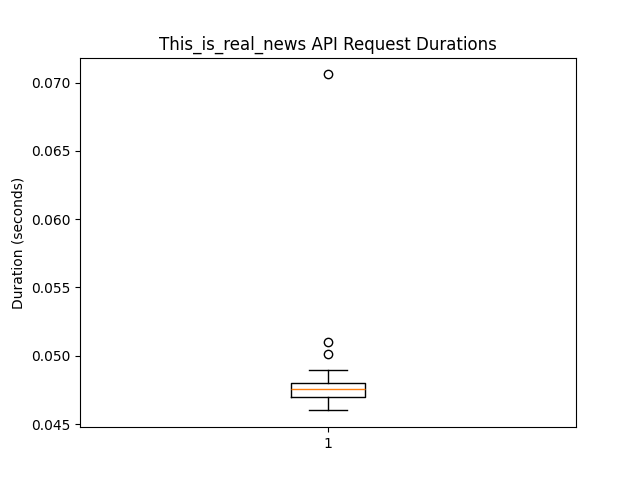
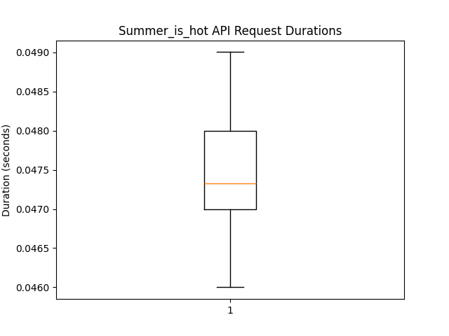
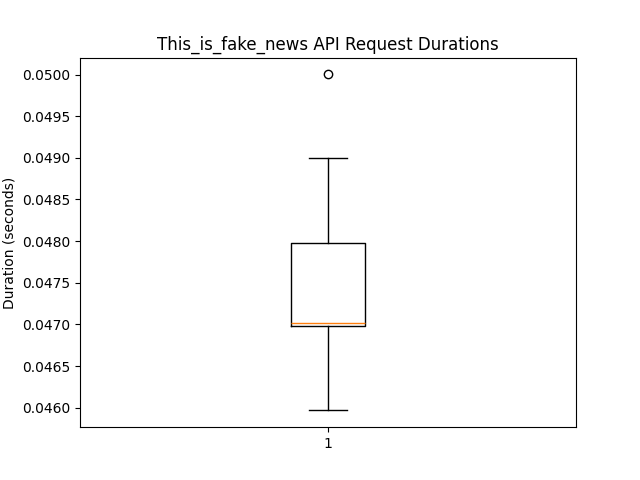
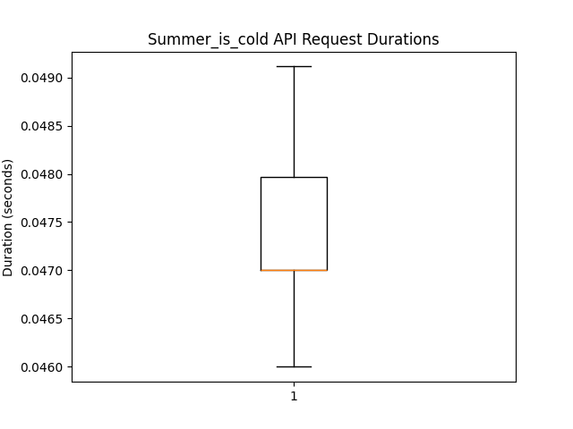

# E444-F2024-PRA5
PRA5 for ECE444
Deployed app: http://pra5-env.eba-eky39tyb.us-east-1.elasticbeanstalk.com/

# Instructions

## Setup
### Activate Virtual Environment

#### Windows
```
.venv\Scripts\activate
```

#### Unix
```
source .venv/Scripts/activate
```

### Install Dependencies
```
pip install -r requirements.txt
```

## Run

### Run App
```
python application.py
```

### Run Tests
```
pytest tests/app_test.py
```

### Performance Box Plots








Average Performance: ~0.047346s